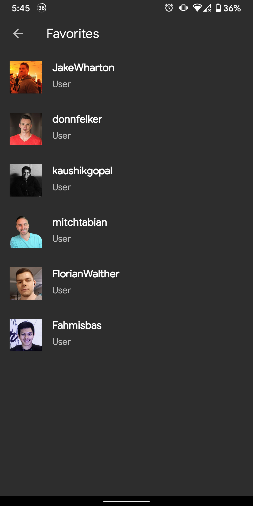

# Github User Finder

<h3 align="center">Splash & Search Screen</h3>

    
    
    
    
     

<h3 align="center">Profile, Favorite & Settings Screen</h3>

    
    
    

## Libraries
- MVVM Design Pattern
- Alarm Manager
- Lifecycle
- Broadcast Receiver
- Kotlin Coroutines
- SQLite Database
- Retrofit 2
- Glide 

